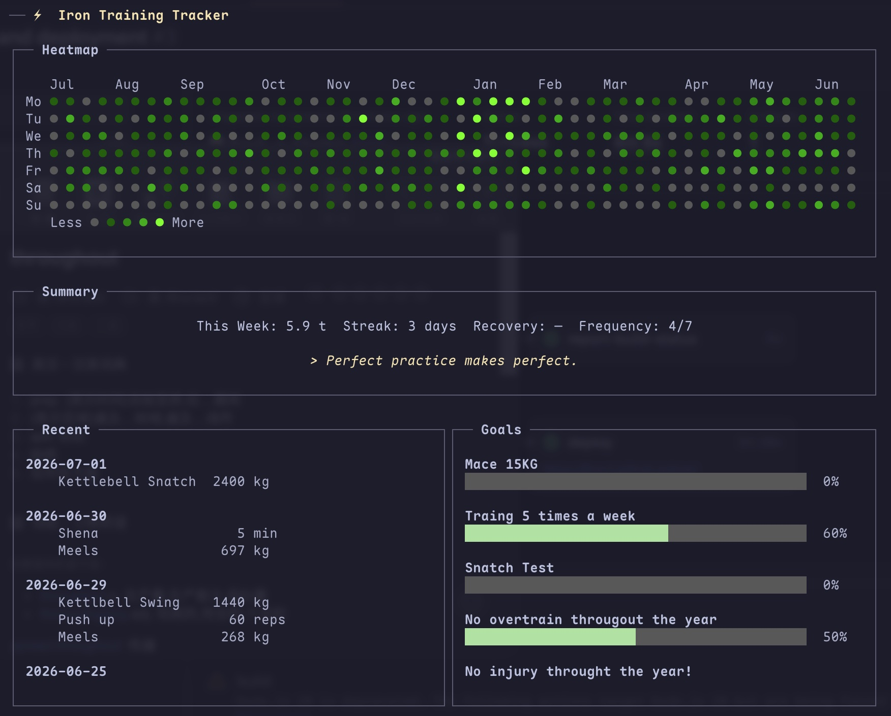

# iron

[English](README.md) | 中文版

一款用于追踪训练记录的终端 UI 应用。你可以逐组记录练习、回顾历史数据，并直观地查看你的训练频率与一致性。所有数据均安全地保存在本地的一个 SQLite 文件中。



## 理念

- **原生终端体验**：全键盘驱动，响应迅速，让你专注于训练本身。
- **本地优先**：你的数据只属于你，仅保存在 `~/.iron/iron.db` 中。
- **极简主义**：无需注册账号，没有复杂的同步机制，拒绝臃肿功能——回归纯粹的训练记录。

## 核心功能

- **逐组记录**：支持重量自动顺延，可记录热身/放松阶段及训练备注。
- **高效修改**：对于已记录的组，可以直接修改或删除，无需重填整条记录。
- **历史记录**：支持过滤筛选，提供内联的详细信息弹窗，并支持编辑、删除及撤销操作。
- **训练趋势**：针对每项练习提供迷你图表（sparkline charts），可自由调整时间窗口。
- **贡献热力图**：在主面板展示类似 GitHub 的训练热力图。
- **目标与里程碑**：通过进度条直观展示目标的达成情况。
- **每日格言**：主面板每日展示格言，可通过专门的界面进行管理。
- **HRV 追踪**：每天早晨记录 0–100 的心率变异性得分。
- **快捷记录（Quick Log）**：基于大语言模型（LLM）的自然语言快捷记录（可选功能）。
- **4 种练习类型**：计重×次数（Weight x Reps）、仅计次数（Reps Only）、距离（Distance, km）和时长（Duration, min）。
- **数据备份**：支持导出和导入 JSON 格式文件。
- **Vim 风格导航**：支持 `j/k`、`h/l`、`/`、`Enter`、`Esc`，且文本输入支持 Emacs 快捷键（`Ctrl+A/E/B/F/K`）。
- **多语言支持**：提供英语和简体中文界面。

## 安装

系统需安装 Rust 1.70+ 版本。

```bash
git clone https://github.com/jhou1/iron.git
cargo build --release
cp target/release/iron ~/.local/bin/
```

## 运行与使用

```bash
iron                   # 英文界面
LANG=zh_CN.UTF-8 iron  # 中文界面
```

### 仪表盘 (Dashboard)

主界面的仪表盘会展示热力图、训练概览、近期活动、当前目标以及每日格言。

| 快捷键 | 动作 |
|-------|-------------------------|
| `l`   | 记录一条训练 |
| `w`   | 快捷记录 (基于 LLM) |
| `h`   | 历史记录 |
| `t`   | 训练趋势 |
| `e`   | 练习项目管理 |
| `g`   | 目标 |
| `Q`   | 每日格言管理 |
| `v`   | 记录今日 HRV |
| `Esc` | 退出 |

### 首次使用设置

1. 按 `e` 进入 **Practices (练习)** 界面。
2. 按 `a` 添加一项练习，输入名称后按回车。
3. 使用 `j/k` 选择练习类型，然后按回车确认：
   - **Weight x Reps** — 记录重量（kg）和次数。
   - **Reps Only** — 仅记录次数（如自重训练）。
   - **Distance** — 记录距离（公里）。
   - **Duration** — 记录时长（分钟）。
4. 按 `Esc` 返回主面板。

### 记录训练 (Logging)

在主界面按 `l` 进入记录界面。

1. 使用 `j/k` 选择或过滤练习项目，按回车选中。
2. 输入每组的数据：
   - 输入重量，按 `Tab` 切换至次数，输入次数后按 `Enter` 提交。
   - 对于负重练习，重量会自动顺延；你只需输入次数并按 `Enter`。
3. 按 `Tab` 键在不同部分间循环切换：组数 → 热身 → 放松 → 备注。
4. 使用 `j/k` 在已记录的组之间导航；按 `e` 修改，按 `d` 删除。
5. 按 `D` 可修改本次训练的日期。
6. 在任何输入框内，按 `Ctrl+S` 可直接保存整条记录。
7. 按 `Esc` 取消。

### 历史记录 (History)

按 `h` 进入。左侧面板显示所有训练记录，右侧面板显示选中记录的详细信息。

| 快捷键 | 动作 |
|---|---|
| `j/k` | 上下移动 |
| `/` | 按练习名称筛选 |
| `e` | 编辑记录 |
| `d` | 删除记录 |
| `u` | 撤销上次删除 |
| `Esc` | 返回 |

### 训练趋势 (Trends)

按 `t` 进入。选中一项练习即可查看它的趋势图表。

| 快捷键 | 动作 |
|---|---|
| `j/k` | 在练习列表中导航 |
| `h/l` | 调整时间窗口 (±30 天，范围在 30–365 天之间) |
| `/` | 过滤练习项目 |
| `Esc` | 返回 |

### 练习项目管理 (Practices)

按 `e` 管理你的练习清单。

| 快捷键 | 动作 |
|---|---|
| `j/k` | 上下移动 |
| `a` | 添加练习 |
| `Enter` | 重命名 |
| `Space` | 切换 激活/隐藏 状态 |
| `d` | 删除 |
| `Esc` | 返回 |

### 目标 (Goals)

按 `g` 进入。

| 快捷键 | 动作 |
|---|---|
| `j/k` | 在目标与里程碑间导航 |
| `a` | 添加目标 |
| `m` | 添加里程碑 |
| `Enter` | 编辑标题 |
| `Space` | 切换完成状态 |
| `D` | 编辑完成日期 |
| `d` | 删除 |
| `Esc` | 返回 |

### 快捷记录 (Quick Log, 依赖 LLM)

按 `w` 进入。使用自然的速记方式输入训练内容（如 `DL 60kg 5/5/5`），然后按 `Ctrl+S` 进行解析。检查解析结果，按回车保存。需要在 `~/.iron/config.toml` 中配置大语言模型（LLM）。

## 数据与备份

所有数据存储在 `~/.iron/iron.db` (SQLite 数据库) 中。你可以通过复制该文件或使用 JSON 导出功能进行备份：

```bash
iron export backup.json
iron import backup.json    # 导入时会自动跳过重复数据
```

应用在首次启动时会自动将旧版本 `~/.ironcli/` 目录中的数据迁移过来。

## 键盘输入快捷键指南

### 文本输入框 (适用所有文本区域)

| 快捷键 | 动作 |
|---|---|
| `Ctrl+B` / 左箭头 | 光标向后移动 |
| `Ctrl+F` / 右箭头 | 光标向前移动 |
| `Ctrl+A` / Home | 跳到行首 |
| `Ctrl+E` / End | 跳到行尾 |
| `Ctrl+K` | 删除光标至行尾的内容 |
| `Backspace` | 删除光标前一个字符 |